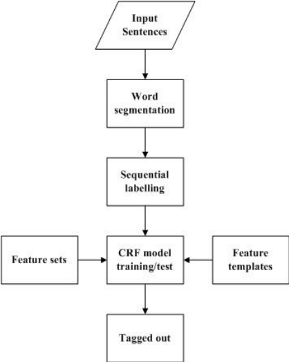

# NLP - Named Entity Recognition CRF model

# Architecture

<center></center>

# Dataset

| Sentence #  | Word        | POS | Tag     |
| ----------- | ----------- | --- | ------- |
| Sentence: 0 | studies     | NNS | O       |
| Sentence: 0 | on          | IN  | O       |
| Sentence: 0 | magnesium   | NN  | O       |
| Sentence: 0 | s           | NN  | O       |
| Sentence: 0 | mechanism   | NN  | O       |
| Sentence: 0 | of          | IN  | O       |
| Sentence: 0 | action      | NN  | O       |
| Sentence: 0 | in          | IN  | O       |
| Sentence: 0 | digitalis   | NN  | plant   |
| Sentence: 0 | induced     | VBD | O       |
| Sentence: 0 | arrhythmias | NNS | disease |
| Sentence: 1 | the         | DT  | O       |
| Sentence: 1 | mechanism   | NN  | O       |
| Sentence: 1 | by          | IN  | O       |
| Sentence: 1 | which       | WDT | O       |
| Sentence: 1 | magnesium   | NN  | O       |
| Sentence: 1 | affects     | VBZ | O       |
| Sentence: 1 | digitalis   | RB  | plant   |
| Sentence: 1 | induced     | JJ  | O       |
| Sentence: 1 | arrhythmias | NN  | disease |
...

# NER Scores

| Averages | Entities | Precision    | Recall       | F-1 Scores   |
| -------- | -------- | ------------ | ------------ | ------------ |
| Micro    | O        | 0,9554764025 | 0,9713337357 | 0,9633398174 |
| Micro    | plant    | 0,9386041849 | 0,9386041849 | 0,9386041849 |
| Micro    | disease  | 0,9386041849 | 0,9386041849 | 0,9386041849 |
|          |          |              |              |              |
| Macro    | O        | 0,9554764025 | 0,9713337357 | 0,9633398174 |
| Macro    | plant    | 0,8865593129 | 0,8557558731 | 0,8696352184 |
| Macro    | disease  | 0,8865593129 | 0,8557558731 | 0,8696352184 |
|          |          |              |              |              |
| Weighted | O        | 0,9554764025 | 0,9713337357 | 0,9633398174 |
| Weighted | plant    | 0,936259236  | 0,9386041849 | 0,9369350301 |
| Weighted | disease  | 0,936259236  | 0,9386041849 | 0,9369350301 |

# **Classifier learned**

```yaml
Top likely transitions:
O      -> O       1.495854
disease -> disease 1.127571
plant  -> plant   0.623030
plant  -> O       -0.264714
O      -> disease -0.350526
O      -> plant   -0.849121
disease -> O       -1.488976
plant  -> disease -2.267951
disease -> plant   -3.829912

Top unlikely transitions:
O      -> O       1.495854
disease -> disease 1.127571
plant  -> plant   0.623030
plant  -> O       -0.264714
O      -> disease -0.350526
O      -> plant   -0.849121
disease -> O       -1.488976
plant  -> disease -2.267951
disease -> plant   -3.829912
```

# **State features**

```yaml
Top positive:
4.551022 plant    word.lower():garlic
4.493458 plant    word.lower():onion
4.264688 disease  word.lower():toxicity
4.222283 plant    word.lower():coriander
4.128144 disease  word.lower():fracture
4.082973 plant    word.lower():pomegranate
3.735797 disease  word.lower():constipation
3.685102 O        -1:word.lower():atherosclerosis
...

Top negative:
-3.345947 O        word.lower():diabetic
-3.084354 O        word.lower():onion
-2.883062 O        word.lower():tumors
-2.777649 O        word.lower():wheat
-2.708049 O        word.lower():hypertension
-2.275229 O        word.lower():cancers
-2.232755 O        word.lower():soybean
-2.051485 O        word.lower():rice
...
```